# Initiation et réflextion du projet

##  - Réflection du projet -
#### Sites web qui ont servit à l'imagination du projet :
- [havas-voyages.fr](https://www.havas-voyages.fr/)
- [cabanes-entreterreetciel.fr](https://www.cabanes-entreterreetciel.fr/)
- [lacabaneenlair.com](https://www.lacabaneenlair.com/fr/)
- [abracadaroom.com](https://www.abracadaroom.com/fr/ )
- [www.cabanes-de-france.com](https://www.cabanes-de-france.com/)
- [hebergement-insolite.com](https://www.hebergement-insolite.com)
- [voyagespirates.fr](https://www.voyagespirates.fr/destinations)
- [abritel.fr](https://www.abritel.fr/guides-voyage/type-de-vacances/insolite)
- [leboisderosoy.com](https://www.leboisderosoy.com/)
- [voyages.carrefour.fr](https://voyages.carrefour.fr/)
- [- bon cadeau - les-cabanes-dans-les-arbres.com](https://www.les-cabanes-dans-les-arbres.com/cabane-bon-cadeau.html)

### Idées/exemples visuelles
- **Pour la conception Backend** 
    - _Intégration de carte_ :
    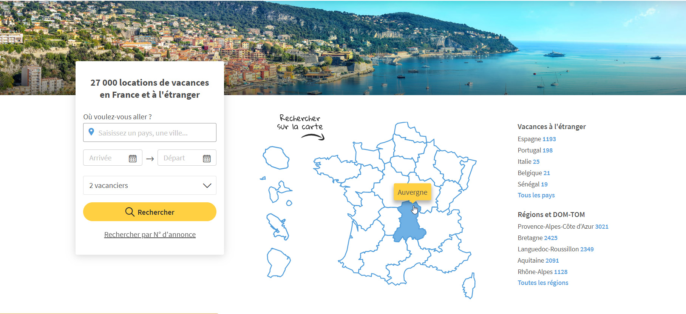
    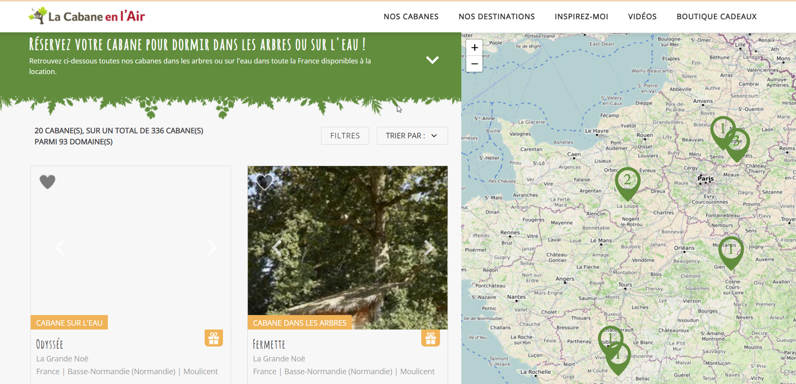
    - _News Letter_ : 
    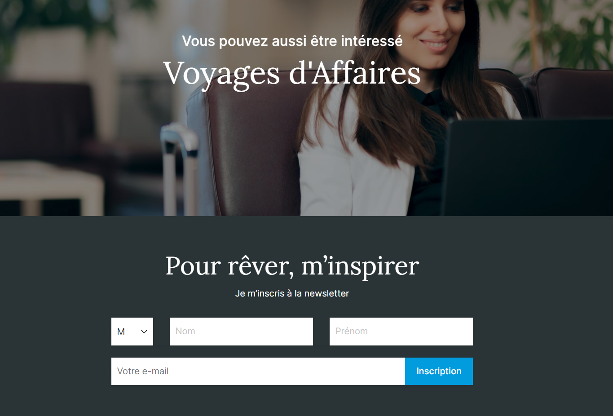
    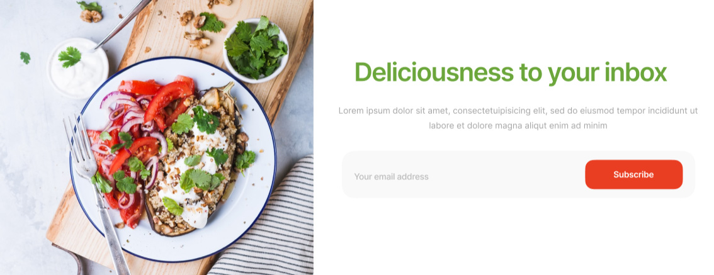
    - Réservation
    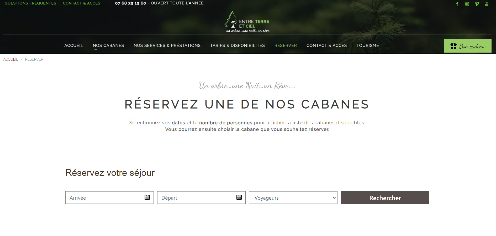
    - Affichage de catégories
    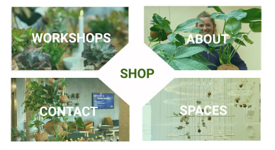
    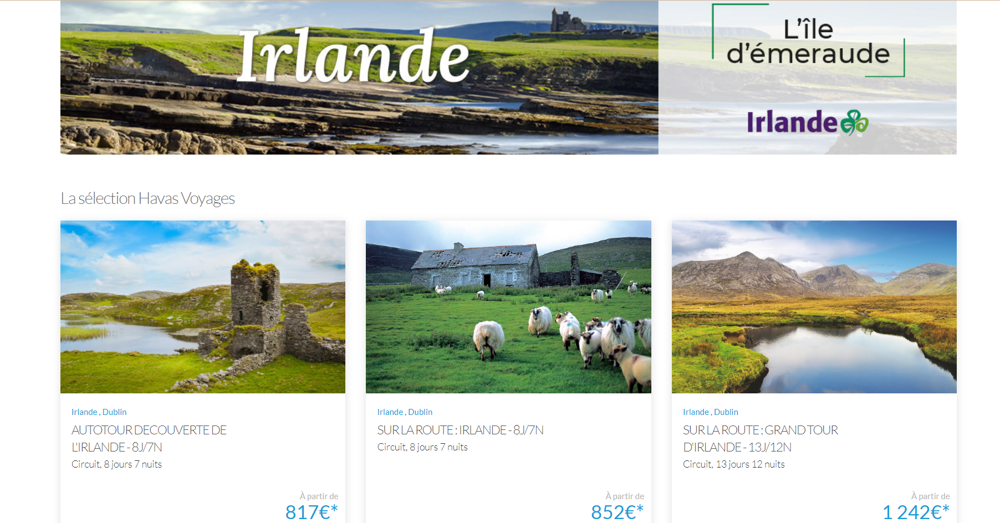
    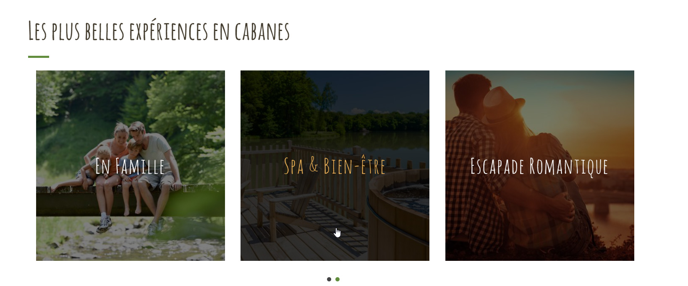
    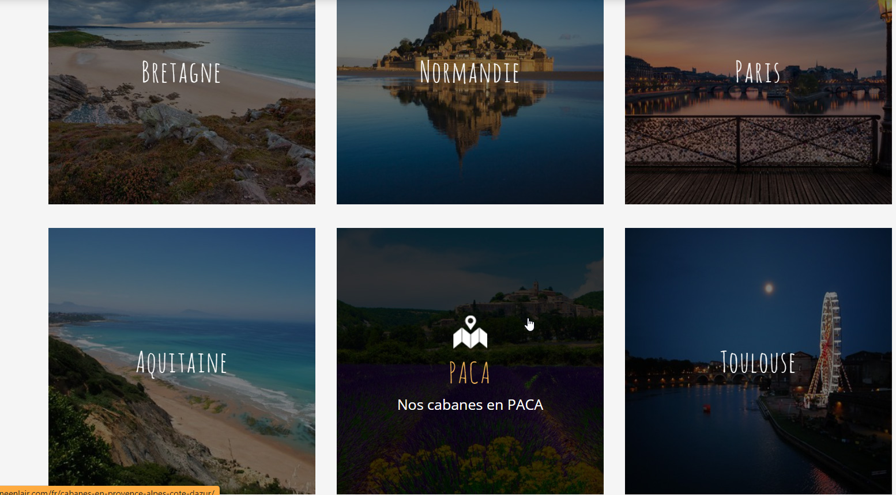
    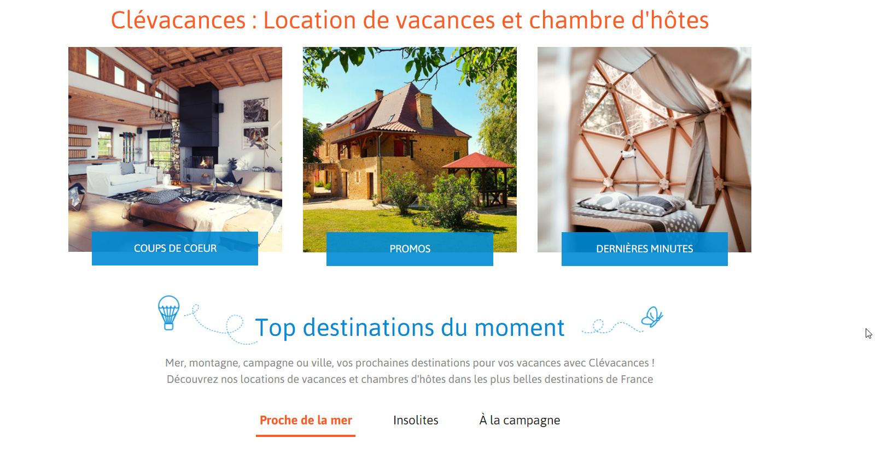
    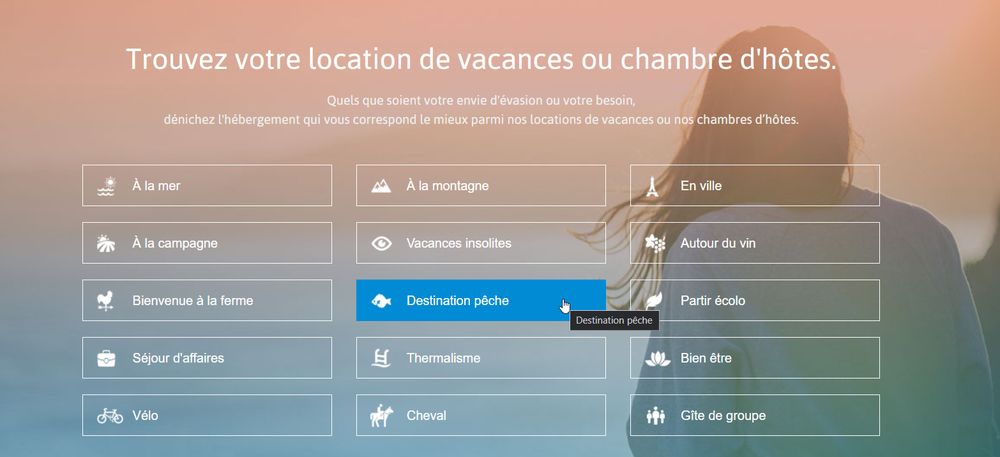
    - Carte cadeau 
    
    - Description du produit BDD
    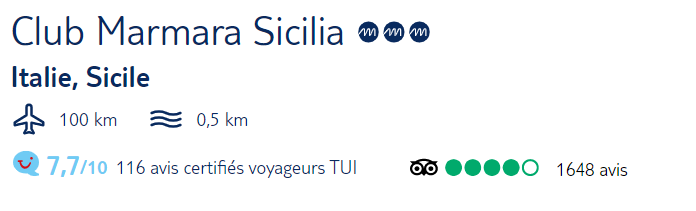
    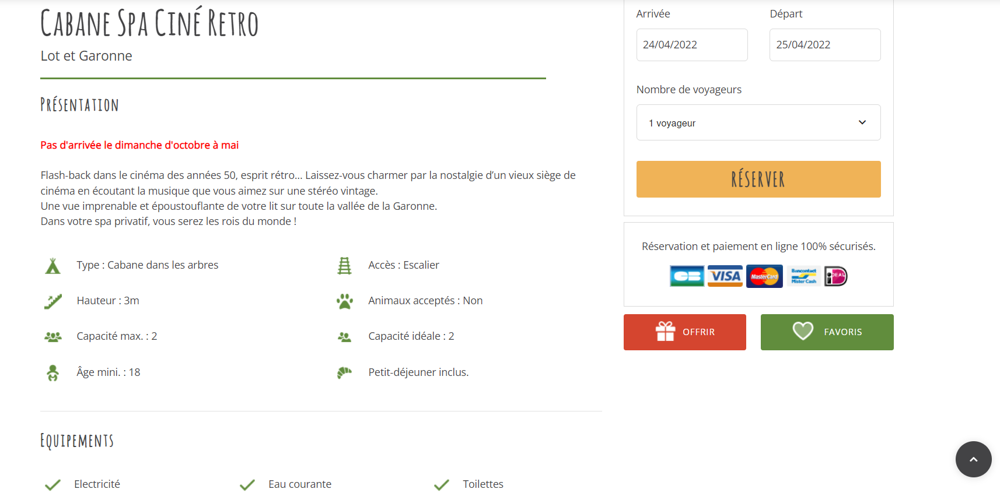

- **Pour conception Frontend**
    - _Header_ 
    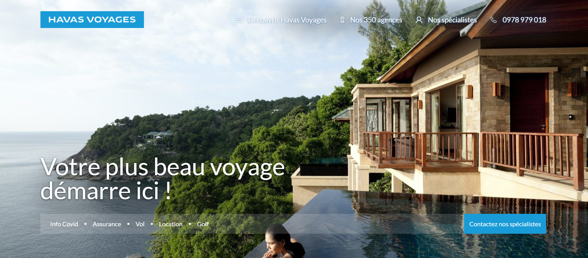
    (header + recherche)
    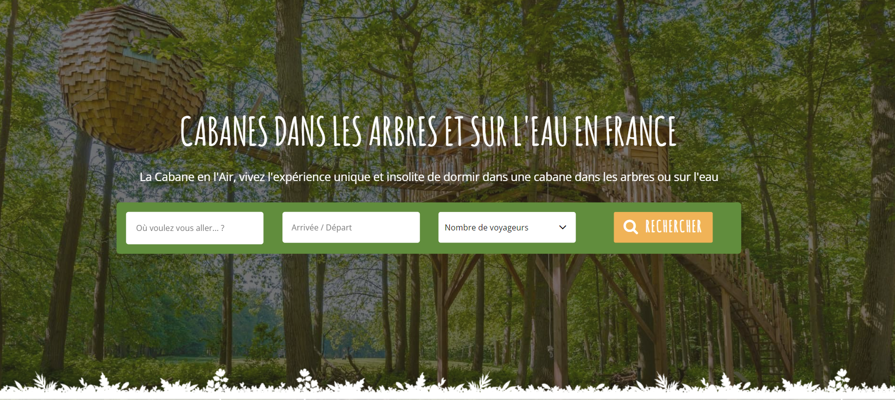
    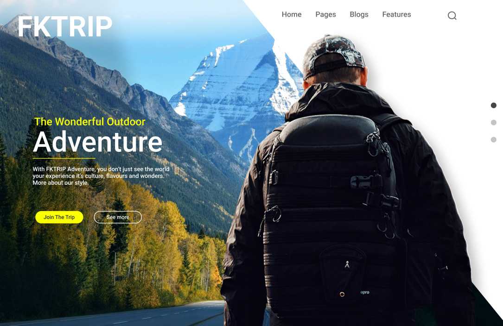
    Header sous forme de vidéo : 
    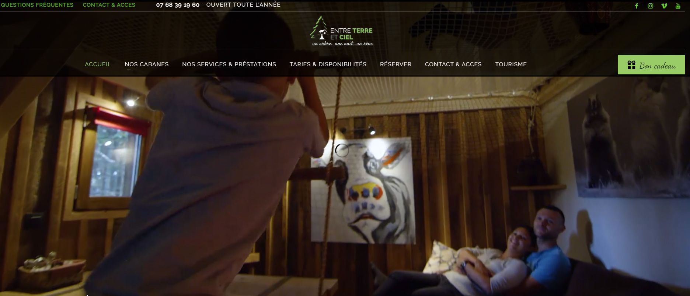
    - _Menu_  
    Avec une transparance
    
    - _Footer_
    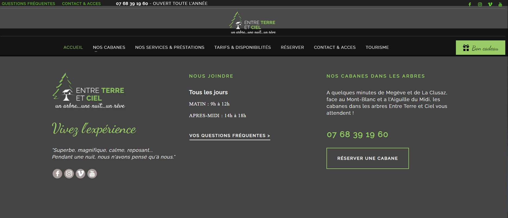
    - _Disposition d'images_
    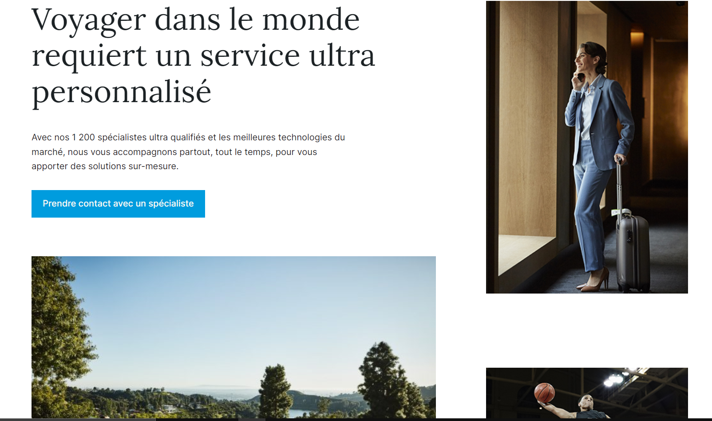
    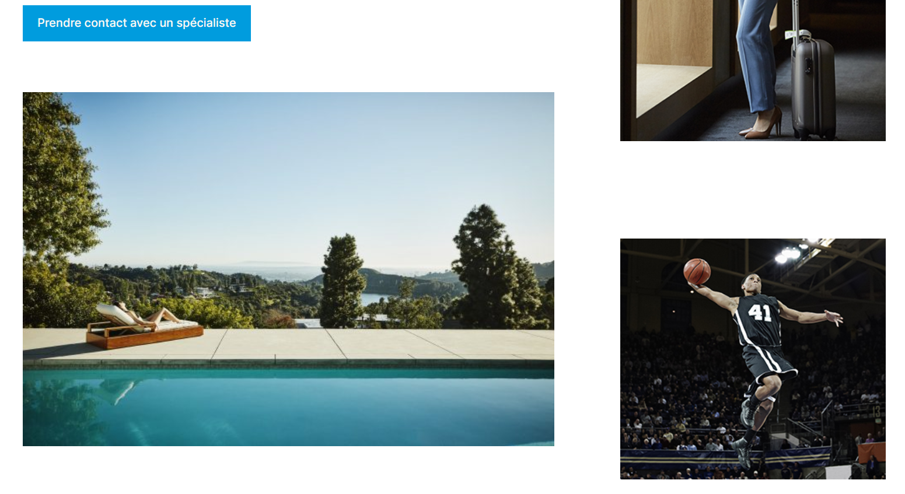
    - _Séparations_
    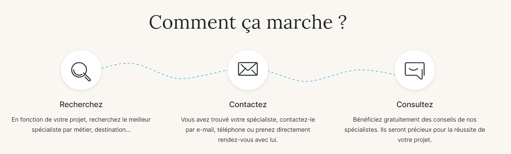
    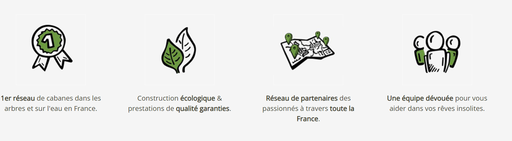
    - _Présentation produit_
    
    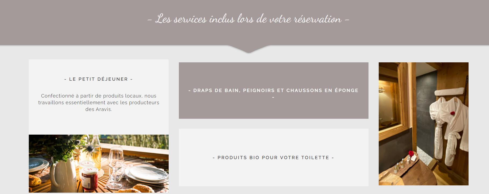
    ***

##  ~ Réflexion conception ~
### Backend :
- intégration BDD : 
    - Produits
        * Tarifs / Réductions
        * Lieux
        * IMG _?BDD ou boucle img ?_
        * Options du séjour (animeaux, wifi, nombre chambres, ..)
        * Catégorie
        * Description
    - **Concevoir une BDD pour les clients**
        * Newslatter
        * Réservations (Close annulation, affichage réservation )
- Interface Admin
    - Gestion des produits
        * Ajout
        * Modifications
        * Supression
    - Gestion des catégories
        * Ajout
        * Modifications
        * Supression
    - Intégration de planning pour les réservations 
        * Ajout
        * Modifications
        * Supression
    - Actualitées
        * Ajout
        * Supression
    - visualisation transaction paiments et remboursement
- Intégration commandes
    - Création du pannier client
    - Intégration de moyen de payement et sécurité
    - Intégration livraison avec tarifs
        * Point relaits
        * A domicile
    - Commande de chèques Cadeaux
    - Prise en compte d'éventuels code promos et réductions produits
    

